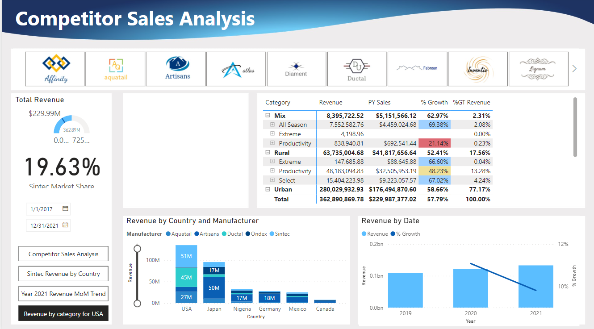
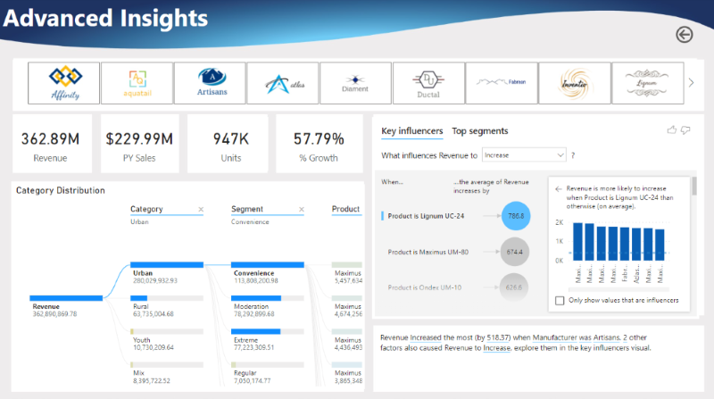

- This Competitor Sales Analysis in Power BI case study offera real-world business use cases for a fictional manufacturing company called Sintec. 
- The primary goal of this case study is to help Sintic assess company product performance compared to competitors. The focus on sales and market share analysis for internal performance, focusing on product revenue.
- **Project Execution**: 
  - Utilize PowerQuery to clean and transform the data
  - Write DAX functions to compare performance
  - Utilize AI visualizations
  - Develop a branded report to share with stakeholders
- Dashboard & Report in Power BI:
  1. Competitor Sale Analysis:
     

  2. Advanced Insights
  
