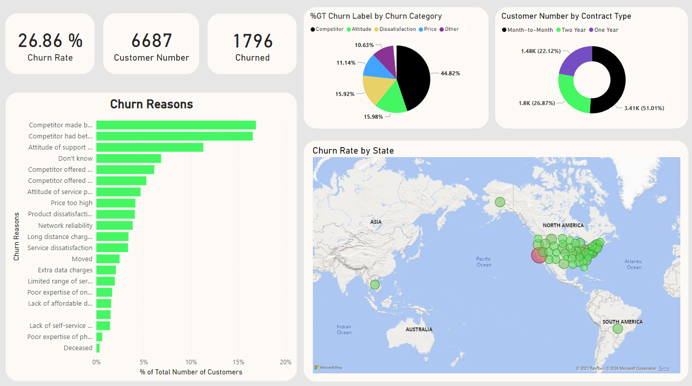

## Power BI Data Analysis Projects
1. Objectives of this project is to uncover insights on customer churn for a fictional telecoms company called Databel
-  First to understand what churn is and how much churn the organization is seeing.
-  The to figure out why customers are churning and providing recommendations on reducing churn.
2. Execution
How to get an insights:
- Create calculated columns and measures with DAX
- Filter and slice your data for deeper analysis
- Combine visualizations to create eye-catching report pages

3. Customer Churn Overview Dashhboard
   

