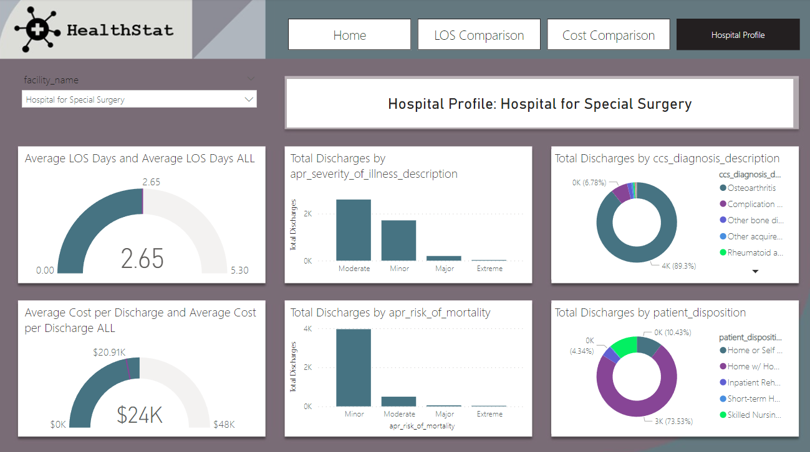

1. **Objectives of this project is to uncover hospital efficiency insights and make recommendations for change.**
- To conduct an initial exploratory analysis before diving deeper into hospital performance outliers
- To understand the factors most influence length of stay and cost per patient discharge.
  
2 . **Project execution**
- Load data and create a data model
- Write DAX functions for data analysis
- Utilize advanced visualizations such as Key Influencers
- Develop a 3-page branded report to share with stakeholders

3. **Overview of the Inventory Analysis**

