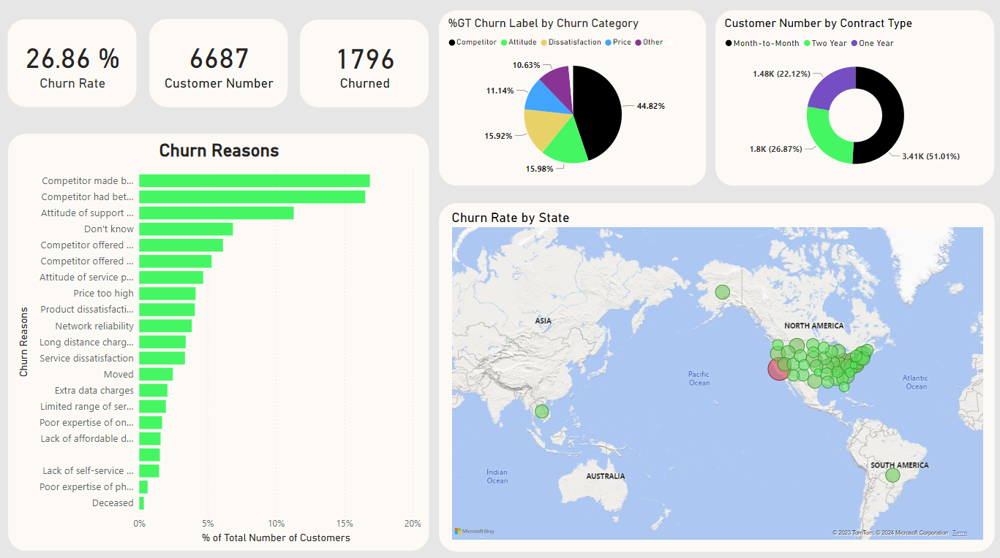

## Projec 1 - Customer Churn Analysis
The objectives of this project is to uncover insights on customer churn for a fictional telecoms company called Databel, more details:
- First to understand what churn is and how much churn the organization is seeing.
- The to figure out why customers are churning and providing recommendations on reducing churn.

 
