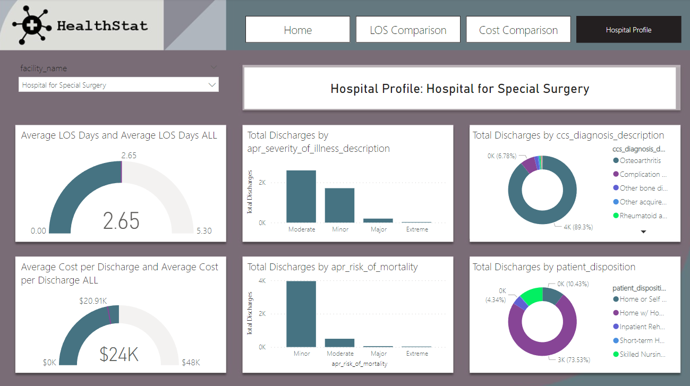
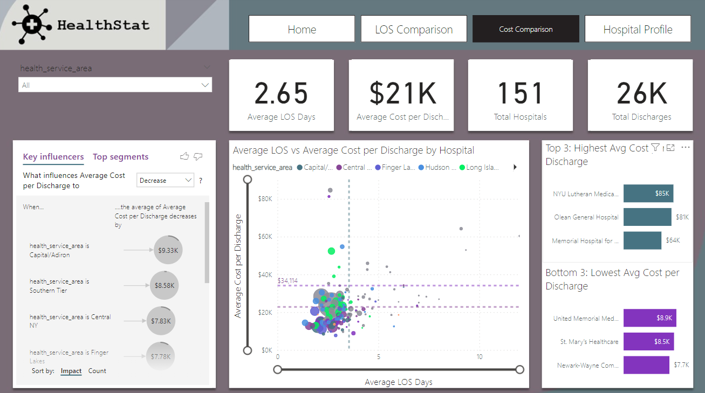
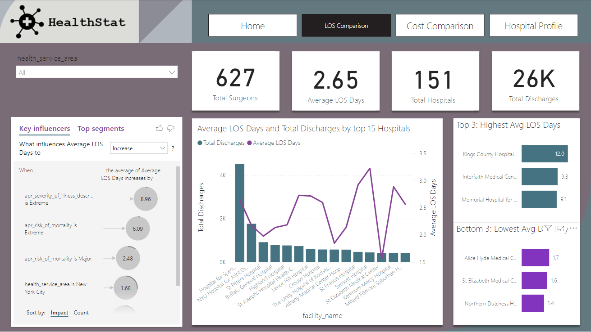

## Projec 1 - Customer Churn Analysis
The objectives of this project is to uncover insights on customer churn for a fictional telecoms company called Databel, more details:
- First to understand what churn is and how much churn the organization is seeing.
- The to figure out why customers are churning and providing recommendations on reducing churn.

 

## Project 2 - Competitor Sales Analysis

The primary goal of this case study is to help Sintic assess company product performance compared to competitors. The focus on sales and market share analysis for internal performance, focusing on product revenue.

## Project 3 - Hospital Efficiency Insights
The objectives of this project is to uncover hospital efficiency insights and make recommendations for change.**
- To conduct an initial exploratory analysis before diving deeper into hospital performance outliers
- To understand the factors most influence length of stay and cost per patient discharge.

3. **Overview of the Inventory Analysis**
There are 3-page brand report to share with stakeholers
  - Report 1. Hospital Profile
    

  - Report 2. Cost comparison
    

  - Report 3. LOS Comparison
    

